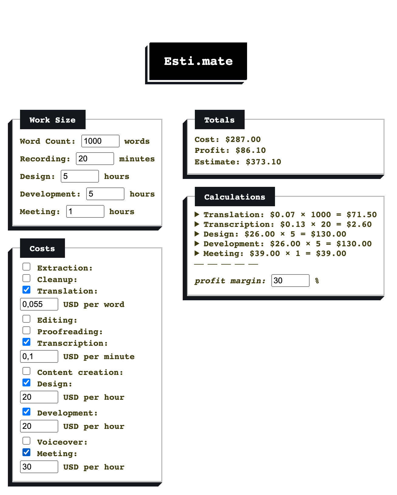

# Esti.mate

[](https://github.com/okturan/esti.mate/actions/workflows/ci.yml)

Esti.mate is a web application designed to help users estimate costs and profits associated with various tasks such as writing, recording, designing, and more. The application allows users to input various parameters related to their projects and provides an estimate based on the inputted data.



The example above combines 1,000 translated words, 20 minutes of transcription, five hours each of design and development, and a one-hour meeting. With a 30% profit margin, Esti.mate calculates a **$287.00 cost**, **$86.10 profit**, and **$373.10 customer estimate**.

## Features

- **Work Size Input**: Users can specify the word count, recording length, design hours, development hours, and meeting hours.
- **Cost Calculation**: Users can choose different services (e.g., extraction, cleanup, translation) and input their respective rates to calculate total costs.
- **Profit Margin**: Users can set a profit margin percentage to see potential profits alongside the total estimate.
- **Dynamic Updates**: The totals and calculations update dynamically as users change their inputs.

## Live Demo

You can try out the live demo of Esti.mate at: [https://esti-mate.pages.dev/](https://esti-mate.pages.dev/)

## Technologies Used

- HTML
- CSS
- JavaScript

The interface has no runtime dependencies. Calculation rules live in `calculator.mjs`, independently from the DOM rendering layer, so mixed-unit totals and rounding behavior can be tested deterministically.

## How to Use

1. Enter the desired values for word count, recording length, design hours, development hours, and meeting hours.
2. Select the services you wish to include in your estimate by checking the corresponding boxes.
3. Input the rates for each service.
4. Adjust the profit margin percentage as needed.
5. The application will automatically calculate and display the total cost, profit, and estimate based on your inputs.

## Installation

To run Esti.mate locally, clone the repository and open `index.html` in your web browser.

```bash
git clone https://github.com/okturan/esti.mate.git
cd esti-mate
open index.html
```

Because the application uses JavaScript modules, a local HTTP server is the most portable development path:

```bash
python3 -m http.server 4173
```

Then open <http://127.0.0.1:4173/>.

## Testing

The test suite covers mixed word/minute/hour calculations, currency rounding, invalid negative inputs, and zero-margin estimates.

```bash
npm ci
npm run check
npm test
npx playwright install chromium
npm run test:browser
```

The Chromium suite exercises a keyboard-only mixed-service estimate, verifies accessible names and conditional rate visibility, and scans the rendered page for automatically detectable WCAG A/AA violations. Automated checks do not replace manual assistive-technology testing.

GitHub Actions runs the calculation and browser checks on pull requests and every push to `master` using pinned, least-privilege actions, then retains the Playwright report for seven days.
